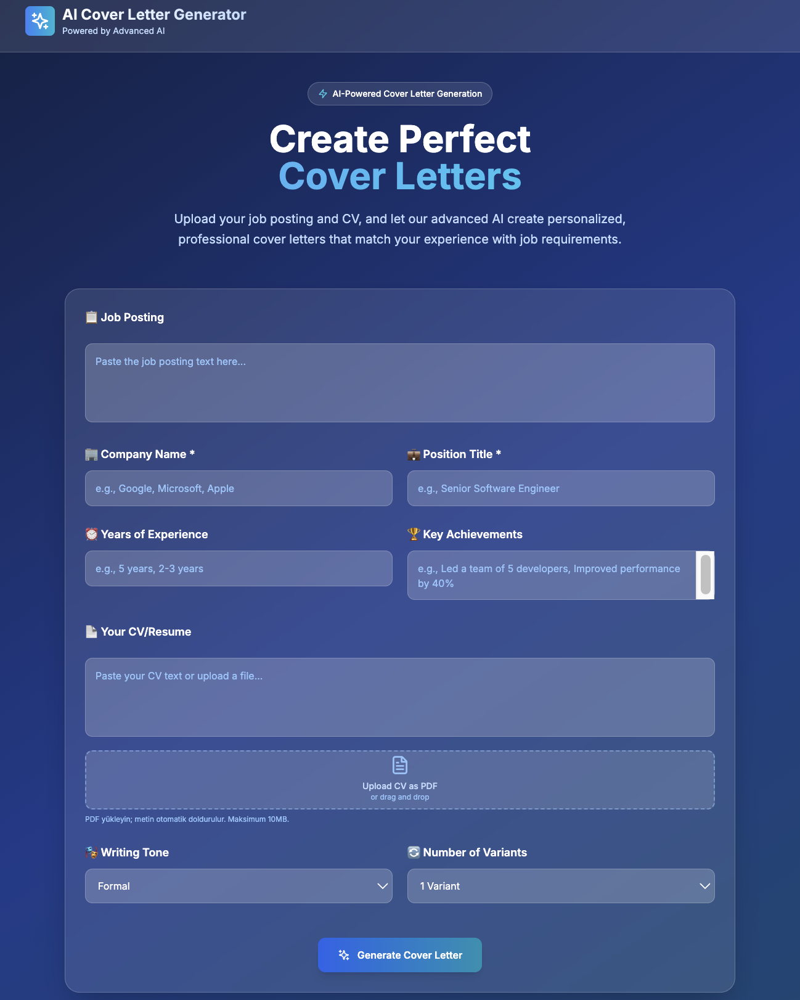

# 🚀 AI-Powered Cover Letter Generator

<div align="center">

**Modern, AI-driven cover letter generator with beautiful UI and advanced NLP capabilities**

[](https://nextjs.org/)
[](https://fastapi.tiangolo.com/)
[](https://www.typescriptlang.org/)
[](https://www.python.org/)
[](https://ollama.ai/)

[Demo](#-demo) • [Features](#-features) • [Tech Stack](#-tech-stack) • [Installation](#-installation) • [Usage](#-usage) • [API](#-api) • [Contributing](#-contributing)

</div>

---

## 📸 Demo & Screenshots

<div align="center">

### 🎨 Modern UI with Dark Blue Theme


*Beautiful glassmorphism design with animated background elements and Turkish interface*

**Features shown in this screenshot:**
- **Job Posting Section**: Large text area for pasting job descriptions
- **Form Fields**: Company name, position title, years of experience, key achievements
- **CV/Resume Section**: Text area with PDF upload functionality
- **Generation Settings**: Tone selection (Formal) and variant count (2 Variants)
- **Modern Design**: Dark blue gradient background with glassmorphism effects
- **Turkish Interface**: Localized UI elements and labels

### 🎯 Application Interface with Sample Data


*Real application interface showing Turkish job posting and CV data*

**What's displayed in this screenshot:**
- **Job Posting**: "Kıdemli Yazılım Mühendisi - Full Stack Geliştirme" with detailed requirements
- **Form Data**: TechCorp company, 6 years experience, Senior Software Engineer position
- **CV Content**: Professional summary in Turkish with technical skills and work experience
- **PDF Upload**: Drag & drop area for CV upload with automatic text extraction
- **Generation Options**: Formal tone selected, 2 variants to generate
- **Modern UI**: Dark blue gradient with glassmorphism design elements

### 🤖 AI-Powered Generation


*Real-time cover letter generation with skill matching analysis*

### 📄 PDF Upload & Export


*Seamless PDF upload and professional export options*

### 📊 Smart Analysis Dashboard


*Comprehensive skill matching and job analysis*

</div>

---

## ✨ Features

### 🤖 **AI-Powered Intelligence**
- **Local LLM Integration**: Uses Ollama with Llama 3.1 8B for high-quality, privacy-focused AI generation
- **Smart NLP Processing**: Advanced skill extraction and matching using SpaCy
- **Multi-language Support**: Generate cover letters in Turkish and English
- **Context-Aware Generation**: AI understands job requirements and CV content

### 🎨 **Modern User Experience**
- **Dark Blue Theme**: Professional glassmorphism design with animated elements
- **Responsive Design**: Perfect experience on desktop, tablet, and mobile
- **Smooth Animations**: Beautiful transitions and hover effects
- **Intuitive Interface**: User-friendly form with smart validation

### 📄 **Advanced Document Handling**
- **PDF Upload**: Drag & drop CV PDFs with automatic text extraction
- **Multi-format Export**: Download as PDF or DOCX with professional formatting
- **Batch Generation**: Create multiple cover letter variants with different tones
- **Real-time Preview**: See generated content before export

### 📊 **Smart Analysis & Matching**
- **Skill Extraction**: AI identifies key skills from job postings and CVs
- **Match Analysis**: Shows skill compatibility with confidence scores
- **Gap Analysis**: Identifies missing skills and provides recommendations
- **Experience Mapping**: Aligns your experience with job requirements

### 🔄 **Flexible Generation Options**
- **Tone Selection**: Choose from Formal, Friendly, or Concise writing styles
- **Multi-variant**: Generate 1-5 different cover letter versions
- **Custom Instructions**: Add specific requirements or preferences
- **Real-time Generation**: Fast, responsive AI-powered content creation

---

## 🛠️ Tech Stack

### **Frontend**
<div align="center">

| Technology | Version | Purpose |
|------------|---------|---------|
|  | 14.0.4 | React framework with App Router |
|  | 5.0 | Type-safe JavaScript |
|  | 3.3 | Utility-first CSS framework |
|  | 0.263.1 | Beautiful icon library |

</div>

### **Backend**
<div align="center">

| Technology | Version | Purpose |
|------------|---------|---------|
|  | 0.104.1 | Modern Python web framework |
|  | Latest | Local LLM for AI generation |
|  | 3.7.5 | Industrial-strength NLP |
|  | 3.0.1 | PDF text extraction |
|  | 4.0.7 | PDF generation |
|  | 1.1.0 | DOCX generation |

</div>

---

## 🚀 Installation

### **Prerequisites**
- **Node.js** 18+ 
- **Python** 3.11+
- **Ollama** (for local AI generation)

### **Quick Start**

1. **Clone the repository**
```bash
git clone https://github.com/Enes-CE/AI-Powered_Cover_Letter_Generator.git
cd AI-Powered_Cover_Letter_Generator
```

2. **Install Ollama**
```bash
# macOS/Linux
curl -fsSL https://ollama.ai/install.sh | sh

# Download Llama 3.1 8B model
ollama pull llama3.1:8b
```

3. **Backend Setup**
```bash
cd backend
python -m venv venv
source venv/bin/activate  # On Windows: venv\Scripts\activate
pip install -r requirements.txt
python -m spacy download en_core_web_sm
```

4. **Frontend Setup**
```bash
cd frontend
npm install
```

5. **Start the Application**
```bash
# Terminal 1: Start Backend
cd backend
source venv/bin/activate
python -c "import uvicorn; from main import app; uvicorn.run(app, host='0.0.0.0', port=8003)"

# Terminal 2: Start Frontend
cd frontend
npm run dev
```

6. **Open Application**
- 🌐 **Frontend**: http://localhost:3000
- 🔧 **Backend API**: http://localhost:8003
- 📚 **API Docs**: http://localhost:8003/docs

---

## 📝 Usage Guide

### **Step 1: Enter Job Information**
- **Job Posting**: Paste the complete job description
- **Company Name**: Enter the company name
- **Position Title**: Specify the job title
- **Years of Experience**: Your relevant experience
- **Key Achievements**: Highlight your accomplishments

### **Step 2: Add Your CV**
- **Text Input**: Paste your CV content directly
- **PDF Upload**: Drag & drop or select a PDF file
- **Auto-extraction**: Text is automatically extracted from PDFs

### **Step 3: Configure Generation**
- **Writing Tone**: Choose Formal, Friendly, or Concise
- **Number of Variants**: Generate 1-5 different versions
- **Custom Instructions**: Add specific requirements (optional)

### **Step 4: Generate & Export**
- **Generate**: Click to create AI-powered cover letters
- **Review**: Check the generated content and analysis
- **Export**: Download as PDF or DOCX
- **Copy**: Copy to clipboard for immediate use

---

## 🔧 Configuration

### **AI Provider Settings**
```python
# backend/app/settings.py
AI_PROVIDER = "ollama"  # ollama | openai | template
OLLAMA_MODEL = "llama3.1:8b"
AI_TIMEOUT = 180  # seconds
```

### **Frontend API Configuration**
```typescript
// frontend/src/lib/api.ts
const API_BASE_URL = process.env.NEXT_PUBLIC_API_URL || 'http://localhost:8003';
```

### **Environment Variables**
```bash
# Backend
AI_PROVIDER=ollama
OLLAMA_BASE_URL=http://localhost:11434
OLLAMA_MODEL=llama3.1:8b
AI_TIMEOUT=180

# Frontend
NEXT_PUBLIC_API_URL=http://localhost:8003
```

---

## 📚 API Documentation

### **Core Endpoints**

#### **Generate Cover Letter**
```http
POST /api/generate-cover-letter
Content-Type: application/json

{
  "job_posting": {
    "job_posting_text": "Senior Software Engineer position..."
  },
  "cv_data": {
    "cv_text": "Experienced developer with 5+ years..."
  },
  "company_name": "TechCorp",
  "position_title": "Senior Software Engineer",
  "years_of_experience": "5 years",
  "key_achievements": "Led team of 5 developers...",
  "tone": "formal",
  "variants": 2
}
```

#### **Extract CV Text from PDF**
```http
POST /api/extract-cv-text
Content-Type: multipart/form-data

file: [PDF file]
```

#### **Export to PDF**
```http
POST /api/export-pdf
Content-Type: application/json

{
  "cover_letter": "Generated cover letter text...",
  "company_name": "TechCorp",
  "position_title": "Senior Software Engineer"
}
```

#### **Export to DOCX**
```http
POST /api/export-docx
Content-Type: application/json

{
  "cover_letter": "Generated cover letter text...",
  "company_name": "TechCorp",
  "position_title": "Senior Software Engineer"
}
```

---

## 🏗️ Project Structure

```
AI-Powered_Cover_Letter_Generator/
├── 📁 backend/                    # FastAPI backend
│   ├── 📁 app/
│   │   ├── 📁 api/               # API endpoints
│   │   │   └── cover_letter.py   # Main API routes
│   │   ├── 📁 models/            # Pydantic models
│   │   │   └── schemas.py        # Request/response schemas
│   │   ├── 📁 services/          # Business logic
│   │   │   ├── ai_service.py     # AI service interface
│   │   │   ├── ollama_service.py # Ollama integration
│   │   │   └── spacy_service.py  # NLP processing
│   │   └── settings.py           # Configuration
│   ├── requirements.txt          # Python dependencies
│   ├── main.py                   # FastAPI app entry
│   └── railway.json              # Railway deployment config
├── 📁 frontend/                   # Next.js frontend
│   ├── 📁 src/
│   │   ├── 📁 app/              # App Router pages
│   │   │   └── page.tsx         # Main application page
│   │   ├── 📁 components/       # React components
│   │   │   ├── ExportButtons.tsx
│   │   │   ├── PdfUpload.tsx
│   │   │   └── Toast.tsx
│   │   └── 📁 lib/              # Utilities
│   │       └── api.ts           # API client
│   ├── package.json             # Node.js dependencies
│   ├── tailwind.config.js       # Tailwind configuration
│   └── vercel.json              # Vercel deployment config
├── README.md                     # Project documentation
└── .gitignore                   # Git ignore rules
```

---

## 🧪 Testing

### **Backend Testing**
```bash
cd backend
source venv/bin/activate
pytest
```

### **Frontend Testing**
```bash
cd frontend
npm test
```

### **API Testing**
```bash
# Health check
curl http://localhost:8003/health

# Generate cover letter
curl -X POST http://localhost:8003/api/generate-cover-letter \
  -H "Content-Type: application/json" \
  -d '{"job_posting":{"job_posting_text":"Test job"}, "cv_data":{"cv_text":"Test CV"}, "tone":"formal"}'
```

---

## 🤝 Contributing

We welcome contributions! Please follow these steps:

1. **Fork** the repository
2. **Create** a feature branch (`git checkout -b feature/amazing-feature`)
3. **Commit** your changes (`git commit -m 'Add amazing feature'`)
4. **Push** to the branch (`git push origin feature/amazing-feature`)
5. **Open** a Pull Request

### **Development Guidelines**
- Follow TypeScript best practices
- Use meaningful commit messages
- Add tests for new features
- Update documentation as needed
- Follow the existing code style

---

## 🙏 Acknowledgments

- **[Ollama](https://ollama.ai)** - For providing local LLM capabilities
- **[SpaCy](https://spacy.io)** - For industrial-strength NLP processing
- **[Next.js](https://nextjs.org)** - For the amazing React framework
- **[FastAPI](https://fastapi.tiangolo.com)** - For the modern Python web framework
- **[Tailwind CSS](https://tailwindcss.com)** - For the utility-first CSS framework

---

## 📞 Support & Contact

- **GitHub Issues**: [Report a bug](https://github.com/Enes-CE/AI-Powered_Cover_Letter_Generator/issues)
- **Discussions**: [Join the conversation](https://github.com/Enes-CE/AI-Powered_Cover_Letter_Generator/discussions)
- **Email**: [Contact us](mailto:c.enes.eng@gmail.com)

---

<div align="center">

**Made with ❤️ using AI and modern web technologies**

[](https://github.com/Enes-CE/AI-Powered_Cover_Letter_Generator/stargazers)
[](https://github.com/Enes-CE/AI-Powered_Cover_Letter_Generator/network)
[](https://github.com/Enes-CE/AI-Powered_Cover_Letter_Generator/issues)

</div>
